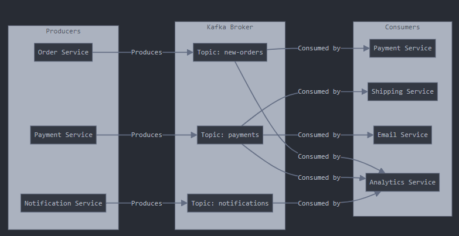

# Kafka

Kafka is a distributed messaging system that efficiently moves information between computer systems in real-time. Think of it as a high-performance mail service capable of delivering millions of messages per second while maintaining reliability.

## When Should You Use Kafka?

Use Kafka when you need:

- To handle high-volume message processing (millions per second)
- To process real-time data streams
- To distribute information across multiple systems
- To maintain message sequence integrity
- To persist messages for future retrieval
- To facilitate communication between multiple services

Avoid using Kafka when:

- Simple request-response communication is sufficient
- Message volume is low
- Only a single system requires the data
- Immediate data updates are crucial
- Your application architecture is straightforward
- Computing resources are limited

Real-world example: Netflix uses Kafka to monitor viewing activity across millions of users (high-volume data needed by multiple systems). However, for simpler operations like account authentication, they use more lightweight solutions.

## Broker (Message Hub)

- Acts as a central hub for message storage and management
- Functions like a post office handling mail distribution
- Supports clustering for scalability and reliability

## Producer (Message Sender)

- Publishes messages to specific topics in the broker
- Similar to someone sending mail through a post office
- Example: Amazon's ordering system produces order-related messages

## Consumer (Message Receiver)

- Subscribes to and processes messages from topics
- Comparable to recipients collecting mail
- Example: Amazon's warehouse system consumes order messages for fulfillment

## Topics (Message Categories)

Topics in Kafka function as organized channels for message distribution, similar to a sophisticated filing system:

Real Example - Uber:

- `new-rides` topic: Manages incoming ride requests
- `driver-location` topic: Tracks real-time driver positions
- `payments` topic: Handles payment processing events

Key Properties:

- Supports partitioning for parallel processing
- Maintains message ordering within partitions
- Enables multiple producers and consumers per topic
- Configurable message retention policies

## Real Example - Netflix

- Producer: Generates viewing events when users start watching
- Broker: Ensures reliable storage of viewing data
- Consumers:
  - Recommendation engine processes viewing patterns
  - Analytics platform monitors content popularity
  - Billing system tracks service usage

## Diagram Flow



> **Note:** `Order Service`, `Payment Service`, and similar components are microservices. Additionally, both `Producers` and `Consumers` can function as microservices.

## Kafka Download

[Apache Kafka](https://kafka.apache.org/downloads)

```bash
# Start the ZooKeeper service
$ bin/zookeeper-server-start.sh config/zookeeper.properties
```

```bash
# Start the Kafka broker service
$ bin/kafka-server-start.sh config/server.properties
```

## Kafka Spring Boot Integration


## Create a Topic

```java
import org.apache.kafka.clients.admin.NewTopic;
import org.springframework.context.annotation.Bean;
import org.springframework.context.annotation.Configuration;
import org.springframework.kafka.config.TopicBuilder;

@Configuration
public class KafkaTopicConfig {

    @Bean
    public NewTopic demoTopic() {
        return TopicBuilder.name("demo-topic")
                .build();
    }
}
```

## Create a Producer

```java
import java.util.HashMap;
import java.util.Map;

import org.apache.kafka.clients.producer.ProducerConfig;
import org.apache.kafka.common.serialization.StringSerializer;
import org.springframework.beans.factory.annotation.Value;
import org.springframework.context.annotation.Bean;
import org.springframework.context.annotation.Configuration;
import org.springframework.kafka.core.DefaultKafkaProducerFactory;
import org.springframework.kafka.core.KafkaTemplate;
import org.springframework.kafka.core.ProducerFactory;

@Configuration  // Tells Spring this is a configuration class that sets up beans
public class KafkaProducerConfig {

    // Gets the Kafka server address from application.properties/yml
    // Example: spring.kafka.bootstrap-servers=localhost:9092
    @Value("${spring.kafka.bootstrap-servers}")
    private String bootstrapServers;

    // This method sets up the basic configuration needed to connect to Kafka
    public Map<String, Object> producerConfig() {
        HashMap<String, Object> props = new HashMap<>();

        // Where to find the Kafka server
        props.put(ProducerConfig.BOOTSTRAP_SERVERS_CONFIG, bootstrapServers);

        // How to convert the message key to bytes for sending
        // Think of this like choosing the envelope format for your letter
        props.put(ProducerConfig.KEY_SERIALIZER_CLASS_CONFIG, StringSerializer.class);

        // How to convert the message value to bytes for sending
        // Think of this like choosing how to write the letter content
        props.put(ProducerConfig.VALUE_SERIALIZER_CLASS_CONFIG, StringSerializer.class);

        return props;
    }

    // Creates a factory that makes Kafka producers
    // Think of this as setting up a mail room in your office
    @Bean
    public ProducerFactory<String, String> producerFactory() {
        return new DefaultKafkaProducerFactory<>(producerConfig());
    }

    // Creates the template we'll use to send messages
    // This is like having a mail clerk who knows how to send letters
    @Bean
    public KafkaTemplate<String, String> kafkaTemplate() {
        return new KafkaTemplate<>(producerFactory());
    }
}
```

## Create a Consumer

```java
import java.util.HashMap;
import java.util.Map;

import org.apache.kafka.clients.consumer.ConsumerConfig;
import org.apache.kafka.common.serialization.StringSerializer;
import org.springframework.beans.factory.annotation.Value;
import org.springframework.context.annotation.Bean;
import org.springframework.context.annotation.Configuration;
import org.springframework.kafka.config.ConcurrentKafkaListenerContainerFactory;
import org.springframework.kafka.config.KafkaListenerContainerFactory;
import org.springframework.kafka.core.ConsumerFactory;
import org.springframework.kafka.core.DefaultKafkaConsumerFactory;
import org.springframework.kafka.listener.ConcurrentMessageListenerContainer;

@Configuration
public class KafkaConsumerConfig {
    // Gets the Kafka server address from application.properties/yml
    // Example: spring.kafka.bootstrap-servers=localhost:9092
    @Value("${spring.kafka.bootstrap-servers}")
    private String bootstrapServers;

    // Sets up the basic configuration needed to receive messages from Kafka
    public Map<String, Object> consumerConfig() {
        HashMap<String, Object> props = new HashMap<>();

        // Where to find the Kafka server
        props.put(ConsumerConfig.BOOTSTRAP_SERVERS_CONFIG, bootstrapServers);

        // How to convert the received message key from bytes back to a String
        // Think of this like knowing how to read the envelope address
        props.put(ConsumerConfig.KEY_DESERIALIZER_CLASS_CONFIG, StringSerializer.class);

        // How to convert the received message value from bytes back to a String
        // Think of this like knowing how to read the letter content
        props.put(ConsumerConfig.VALUE_DESERIALIZER_CLASS_CONFIG, StringSerializer.class);

        return props;
    }

    // Creates a factory that makes Kafka consumers
    // Think of this as hiring staff who know how to receive messages
    @Bean
    public ConsumerFactory<String, String> consumerFactory() {
        return new DefaultKafkaConsumerFactory<>(consumerConfig());
    }

    // Creates a factory for message listeners
    // This is like setting up a mail room that can handle multiple mail clerks
    @Bean
    public KafkaListenerContainerFactory<ConcurrentMessageListenerContainer<String, String>> listenerFactory(
            ConsumerFactory<String, String> consumerFactory) {
        ConcurrentKafkaListenerContainerFactory<String, String> factory =
            new ConcurrentKafkaListenerContainerFactory<>();
        factory.setConsumerFactory(consumerFactory);
        return factory;
    }
}
```

## Create Listener

```java
import org.springframework.kafka.annotation.KafkaListener;
import org.springframework.stereotype.Component;

@Component  // Tells Spring to manage this class as a component
public class KafkaMessageListener {

    // This annotation tells Kafka: "Listen for messages on demo-topic"
    // groupId is like a team name - all consumers in the same group share the workload
    @KafkaListener(topics = "demo-topic", groupId = "group_id")
    public void listener(String message) {
        // Currently just prints the message to the console
        System.out.println("Listener received: " + message);
    }
}
```

## Create REST Endpoint

```java
import org.springframework.kafka.core.KafkaTemplate;
import org.springframework.web.bind.annotation.PostMapping;
import org.springframework.web.bind.annotation.RequestBody;
import org.springframework.web.bind.annotation.RequestMapping;
import org.springframework.web.bind.annotation.RestController;

import com.revature.kafka_demo.dtos.requests.MessageRequest;

@RestController
@RequestMapping("/api/messages")
public class MessageController {
    private KafkaTemplate<String, String> kafkaTemplate;

    public MessageController(KafkaTemplate<String, String> kafkaTemplate) {
        this.kafkaTemplate = kafkaTemplate;
    }

    // Handles POST requests to /api/messages
    @PostMapping
    public void publish(@RequestBody MessageRequest request) {
        // Sends the message to a Kafka topic named "demo-topic"
        kafkaTemplate.send("demo-topic", request.message());
    }
}

// This would be in a separate file
// record is a Java feature that creates a simple data class
public record MessageRequest(String message) { }
```
